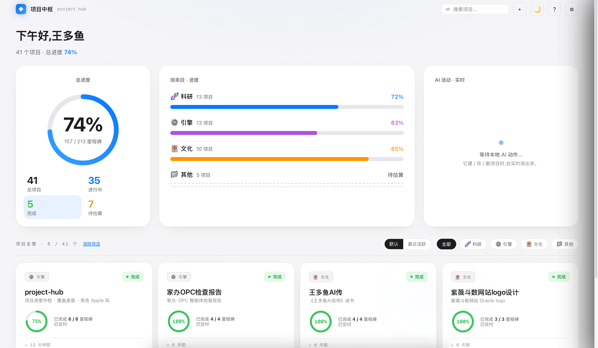

# 项目中枢 project-hub

**AI 在干活，桌面在长进度。**

一个常驻 macOS 桌面壁纸层的本地项目驾驶舱：把「项目根目录下的每个文件夹」变成一张带进度环的卡片——你的 AI（Claude Code / Cursor / Codex / 任意本地模型）改一个 `.project.json` 文件，**1 秒内**桌面上的进度环就转起来。



## 为什么需要它

当你同时有十几个项目、由一个或多个 AI 并行推进时，真正的问题不是"干活"，而是**「现在到哪了」没有人说得清**——进度散落在十几个终端、聊天记录和 HANDOFF 文档里。

project-hub 的回答：**不打扰任何工作流，只做被动观测**。AI 在它自己的工具里干活，顺手写一个 JSON 文件，桌面自动呈现全局——总进度、分类进度、每个项目卡在哪个里程碑、AI 刚刚动了什么。

> 它不是又一个任务编排器（那条赛道已经很挤），而是**项目级的环境信息显示器（ambient display）**——像挂在墙上的仪表盘，而不是又一个要你登录的网站。

## 它的几个硬指标

| 能力 | 实现 |
|---|---|
| **1 秒实时** | macOS FSEvents 文件监听（非轮询）：`.project.json` 一落盘，桌面 1 秒内上屏；窗口在后台同样生效 |
| **零配置接入** | 文件即接口——任何能写文件的 AI/脚本/人，写个 JSON 就接入了，没有 SDK、没有注册、没有 token |
| **MCP 原生** | 自带零依赖 MCP 服务器（单文件，4 个工具），Claude Code / Cline 等 MCP 客户端一行配置直连 |
| **增量扫描** | 按 mtime 三元组缓存，百个项目也只重读真正变化的那一个 |
| **本地优先** | 数据就是你磁盘上的文件；HTTP 端口只绑 127.0.0.1；零云端、零上传、零账号 |
| **壁纸层常驻** | `⌘⇧P` 一键沉入桌面图标之下，不占 Dock、不抢 Cmd-Tab |

## 安装（macOS · Apple Silicon）

1. 下载 [Releases](../../releases) 中的 `project-hub_x.x.x_aarch64.dmg`，拖入「应用程序」
2. 首次打开若提示"无法验证开发者"：系统设置 → 隐私与安全性 → 「仍要打开」（或 `xattr -cr /Applications/project-hub.app`）
3. 跟随首次启动引导选择你的「项目根目录」——完成

## 三步上手

```jsonc
// 在任意项目文件夹放一个 .project.json
{
  "name": "我的项目",
  "category": "引擎",          // 科研 | 引擎 | 文化 | 其他
  "emoji": "⚙️",
  "tagline": "一句话简介",
  "status": "active",          // active | done | failed
  "goal": "一句话目标",
  "branches": [
    { "name": "主线", "milestones": [
      { "title": "第一个里程碑", "done": true },
      { "title": "第二个里程碑", "done": false }
    ]}
  ]
}
```

进度 = 已完成里程碑 / 总数。**改文件即生效。** 没有 `.project.json` 的文件夹会显示为「待估算」，点开可让内置 AI 侦察文件夹内容并拟一份草稿。

## 让你的 AI 接入（三选一）

| 方式 | 适用 | 接入成本 |
|---|---|---|
| **文件协议**（推荐） | 任何能写文件的 AI | 把应用内「? → 接入你的 AI」的回写约定贴进 CLAUDE.md / .cursorrules / 系统提示词，**一次粘贴** |
| **HTTP API** | 任何能发请求的程序 | `127.0.0.1:3120`：`GET /api/projects` · `POST /api/project/{create,update,delete}` · `GET/POST /api/config` |
| **MCP** | Claude Code / Cline 等 | `scanner/mcp-server.mjs`（零依赖单文件），客户端配置一行，获得增删改查 4 工具 |

AI 改动会实时滚进「AI 活动」流，并弹原生系统通知——**你不看它的时候，它也在替你盯着**。

## 架构（1 分钟读懂）

```
你的项目文件夹们           project-hub.app (Tauri 2)
┌──────────────┐   FSEvents   ┌─────────────────────────┐
│ A/.project.json│ ──────────→ │ Rust: watcher + 增量扫描   │
│ B/.project.json│             │  ├─ HTTP :3120 (本机)     │ ←── curl / 任意程序
│ C/HANDOFF.md  │              │  └─ emit("projects-changed")│ ←── MCP server (stdio)
└──────────────┘              │ React: 驾驶舱 UI (壁纸层)  │
        ↑ 写文件               └─────────────────────────┘
   任何 AI / 任何人
```

技术栈：Tauri 2（Rust）+ React 18 + Vite。无数据库、无后端服务、无网络依赖。

## 开发

```bash
npm i
npm run dev        # 浏览器开发
npx tauri dev      # 桌面窗口开发
npx tauri build    # 打包 .app + .dmg
```

## Roadmap

- [ ] 活动流接真操作日志（谁、用什么工具、改了什么）
- [ ] 原生目录选择器 / 签名公证 / 自动更新
- [ ] Windows / Linux（壁纸层为 macOS 专属，其余可移植）
- [ ] 周报视图：本周各项目推进汇总

## 致谢

本项目由 [Claude](https://claude.com)（Opus 4.8 起稿，Fable 5 完成实时机制与产品化）与王多鱼协作构建——它本身就是「AI 干活，桌面长进度」工作流的产物：仓库里的 `.project.json` 记录着它自己的里程碑。

MIT License · 数据永远在你自己的磁盘上
